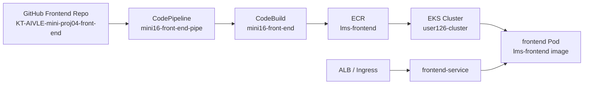
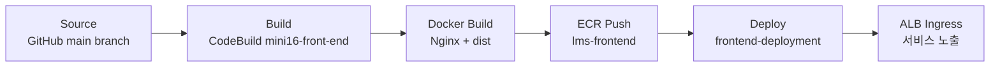

# LMS Frontend - EKS 기반 CI/CD 배포 문서

## 프로젝트 개요

이 repository는 도서 관리 및 에피소드 서비스의 프론트엔드 애플리케이션입니다. React와 Vite를 기반으로 로그인/회원가입, 도서 목록, 도서 상세, 에피소드 작성/조회, 댓글, 좋아요, AI 커버 생성 화면을 제공합니다.

우리 조는 프론트엔드와 백엔드를 모두 EKS에 배포하는 구조를 목표로 합니다. 프론트엔드는 정적 파일만 제공한다면 S3 배포도 가능하지만, 로그인 쿠키, 백엔드 API 연동, 같은 ALB 아래에서의 라우팅 구성을 고려해 백엔드와 동일하게 컨테이너 기반 EKS 배포 대상으로 잡았습니다.

공통 클라우드 아키텍처, 네트워크, EKS, IAM, Auto Scaling, CloudWatch 상세 설명은 백엔드 README를 기준 문서로 관리합니다.

- 공통 클라우드 기준 문서: https://github.com/aivle-bigproject-16/KT-AIVLE-mini-proj05-back-end

## Frontend Repository 구성

```text
KT-AIVLE-mini-proj04-front-end/
├── api/                      # json-server 또는 서버리스 형태의 API 보조 코드
├── public/                   # 정적 리소스, 아이콘, favicon
├── src/                      # React 프론트엔드 소스코드
│   ├── assets/               # 이미지, SVG 등 화면 자산
│   ├── common/               # 공통 레이아웃, Header/Footer/Button 등 재사용 컴포넌트
│   ├── hooks/                # API 호출 및 화면 로직용 커스텀 훅
│   │   └── auth/             # 로그인, 회원가입, 토큰 갱신 관련 훅
│   ├── screen/               # 주요 페이지 단위 컴포넌트
│   ├── utils/                # 인증 저장소, 검색 유틸 등 공통 유틸
│   ├── App.jsx               # 라우팅 및 최상위 앱 구성
│   └── main.jsx              # React 앱 진입점
├── buildspec.yml             # 현재 CodeBuild용 프론트엔드 빌드 명세
├── package.json              # npm scripts 및 의존성
├── vite.config.js            # Vite 설정
├── vercel.json               # 기존 배포 설정 파일
└── README.md
```

## 주요 기술 스택

| 구분 | 사용 기술 |
| --- | --- |
| Framework | React 19 |
| Build Tool | Vite |
| Routing | react-router-dom |
| API 통신 | axios |
| 상태 관리 | zustand |
| Mock/API 보조 | json-server |
| CI/CD | GitHub, AWS CodePipeline, AWS CodeBuild |
| Container Registry | Amazon ECR |
| Deployment Target | Amazon EKS |

## 프론트엔드 배포 선택 이유

| 선택 항목 | 이유 |
| --- | --- |
| EKS 배포 | 백엔드와 같은 클러스터에서 실행해 ALB/Ingress 라우팅을 단순화합니다. |
| Docker 이미지 | Vite 빌드 결과물을 Nginx 컨테이너로 실행하면 실행 환경이 고정됩니다. |
| ECR `lms-frontend` | CodeBuild가 만든 프론트엔드 이미지를 저장하고 EKS에서 pull합니다. |
| ALB Ingress | `/` 화면 요청은 frontend-service로, API 요청은 backend-service로 나눌 수 있습니다. |
| Auto Scaling | 트래픽 증가 시 frontend Pod replica를 늘려 정적 리소스 응답 부하를 분산합니다. |

## 전체 클라우드 구조

공통 구조는 백엔드 README의 전체 클라우드 구조를 기준으로 합니다. 프론트엔드는 아래 흐름에서 `Frontend GitHub Repo -> mini16-front-end-pipe -> mini16-front-end -> lms-frontend -> frontend Pod` 구간을 담당합니다.



## 현재 CI/CD 상태

현재 `buildspec.yml`은 Node.js 20 환경에서 프론트엔드 정적 빌드를 수행합니다.

```text
install: Node.js 20 런타임 사용
pre_build: npm install
build: npm run build
artifacts: dist 폴더 산출물 생성
```

즉, 현재 상태는 Vite build 결과물 생성까지이며, EKS 컨테이너 배포를 완료하려면 Docker/ECR/Deploy 단계가 추가되어야 합니다.

## 목표 CI/CD 파이프라인



## 각 스테이지에서 필요한 세팅

| Stage | 필요한 세팅 | 현재 상태 |
| --- | --- | --- |
| Source | GitHub Connector로 `aivle-bigproject-16/KT-AIVLE-mini-proj04-front-end` 연결 | 구성됨 |
| Build | `npm install`, `npm run build` | 구성됨 |
| Docker Build | `Dockerfile`, `nginx.conf`, ECR login, image tag 설정 | 추가 필요 |
| ECR Push | `879772956301.dkr.ecr.us-east-1.amazonaws.com/lms-frontend`로 push | 추가 필요 |
| Deploy | `frontend-deployment.yaml`, `frontend-service.yaml` 적용 | 추가 필요 |
| Routing | Ingress에서 `/` 또는 프론트 경로를 frontend-service로 연결 | 추가 필요 |
| Scaling | `frontend-hpa.yaml`로 CPU 기준 replica 조절 | 추가 필요 |

## 추가해야 할 배포 파일

| 파일 | 역할 |
| --- | --- |
| `Dockerfile` | Vite 빌드 결과물인 `dist`를 Nginx 컨테이너로 실행합니다. |
| `nginx.conf` | React SPA 새로고침 시 404가 나지 않도록 `index.html` fallback을 설정합니다. |
| `k8s/frontend-deployment.yaml` | `lms-frontend` 이미지를 사용하는 frontend Pod와 replica 수를 정의합니다. |
| `k8s/frontend-service.yaml` | frontend Pod를 내부 Service로 묶어 Ingress가 접근할 수 있게 합니다. |
| `k8s/frontend-hpa.yaml` | CPU 기준으로 frontend Pod replica를 자동 조절합니다. |

Ingress는 프론트와 백엔드가 함께 사용하는 공통 라우팅 리소스이므로 백엔드 README의 공통 클라우드 기준 문서에서 관리합니다.

## 프론트엔드 요청 흐름

```text
User Browser
-> ALB
-> Ingress
-> frontend-service
-> frontend Pod
-> Nginx
-> React 정적 파일 제공
-> React 앱에서 백엔드 API 호출
```

## 실행 명령

```powershell
npm install
npm run dev
```

PowerShell에서 `npm.ps1` 실행 정책 오류가 발생하면 아래처럼 `npm.cmd`를 사용할 수 있습니다.

```powershell
npm.cmd install
npm.cmd run dev
```

## 민감정보 관리

`.env`에는 API 주소나 환경 변수가 들어갈 수 있으므로 GitHub에 올리지 않습니다. AWS Access Key, DB 비밀번호, JWT Secret 같은 값은 README에 기록하지 않고, 배포 환경에서는 Kubernetes Secret, AWS Secrets Manager, CodeBuild 환경 변수로 관리합니다.

## 미니프로젝트 6차 R&R

| 역할 | 담당 | 비고 |
| --- | --- | --- |
| 조장 | 김경순 | 기술 P1 겸임, 전체관리 |
| 발표자 | 심경민 | Day3 발표 |
| 서기 | 공다연 | 기록, README |
| 검토 담당자 | 김성준, 장윤재 | 크로스체크, 칸반보드 보조 |
| 타임키퍼 | 김현민 | 칸반보드 관리 |
| ppt 제작자 | 김창민, 조승대 | 3일차 발표자료 |