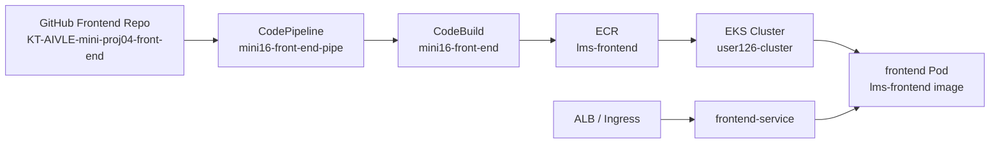
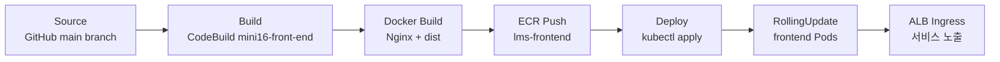

# LMS Frontend - EKS 기반 CI/CD 배포 문서

## 프로젝트 개요

이 repository는 도서 관리 및 에피소드 서비스의 프론트엔드 애플리케이션입니다. React와 Vite를 기반으로 로그인/회원가입, 도서 목록, 도서 상세, 에피소드 작성/조회, 댓글, 좋아요, AI 커버 생성 화면을 제공합니다.

우리 조는 프론트엔드와 백엔드를 모두 EKS에 배포하는 구조를 목표로 합니다. 프론트엔드는 정적 파일만 제공한다면 S3 배포도 가능하지만, 로그인 쿠키, 백엔드 API 연동, 같은 ALB 아래에서의 라우팅 구성을 고려해 백엔드와 동일하게 컨테이너 기반 EKS 배포 대상으로 잡았습니다.

공통 클라우드 아키텍처, 네트워크, EKS, IAM, Auto Scaling, CloudWatch 상세 설명은 백엔드 README를 기준 문서로 관리합니다.

- 공통 클라우드 기준 문서: https://github.com/aivle-bigproject-16/KT-AIVLE-mini-proj05-back-end

## Frontend Repository 구성

```text
KT-AIVLE-mini-proj04-front-end/
├── api/                          # json-server 또는 서버리스 형태의 API 보조 코드
├── k8s/                          # EKS 배포용 Kubernetes 매니페스트
│   ├── frontend-config.yaml      # 프론트엔드 환경 설정 ConfigMap
│   ├── frontend-deployment.yaml  # frontend Pod/replica/RollingUpdate 정의
│   └── frontend-service.yaml     # frontend Pod 접근용 ClusterIP Service
├── public/                       # 정적 리소스, 아이콘, favicon
├── src/                          # React 프론트엔드 소스코드
│   ├── assets/                   # 이미지, SVG 등 화면 자산
│   ├── common/                   # 공통 레이아웃, Header/Footer/Button 등 재사용 컴포넌트
│   ├── hooks/                    # API 호출 및 화면 로직용 커스텀 훅
│   │   └── auth/                 # 로그인, 회원가입, 토큰 갱신 관련 훅
│   ├── screen/                   # 주요 페이지 단위 컴포넌트
│   ├── utils/                    # 인증 저장소, 검색 유틸 등 공통 유틸
│   ├── App.jsx                   # 라우팅 및 최상위 앱 구성
│   └── main.jsx                  # React 앱 진입점
├── buildspec.yml                 # Docker image build + ECR push용 CodeBuild 명세
├── dockerfile                    # Vite build 후 Nginx 이미지로 실행하는 Docker 빌드 파일
├── nginx.conf                    # React SPA fallback 설정
├── package.json                  # npm scripts 및 의존성
├── vite.config.js                # Vite 설정
├── vercel.json                   # 기존 배포 설정 파일
└── README.md
```

## 주요 기술 스택

| 구분 | 사용 기술 |
| --- | --- |
| Framework | React 19 |
| Build Tool | Vite |
| Runtime Container | Nginx |
| Routing | react-router-dom |
| API 통신 | axios |
| 상태 관리 | zustand |
| CI/CD | GitHub, AWS CodePipeline, AWS CodeBuild |
| Container Registry | Amazon ECR |
| Deployment Target | Amazon EKS |

## 프론트엔드 배포 선택 이유

| 선택 항목 | 이유 |
| --- | --- |
| EKS 배포 | 백엔드와 같은 클러스터에서 실행해 ALB/Ingress 라우팅을 단순화합니다. |
| Docker 이미지 | Vite 빌드 결과물을 Nginx 컨테이너로 실행하면 실행 환경이 고정됩니다. |
| ECR `lms-frontend` | CodeBuild가 만든 프론트엔드 이미지를 저장하고 EKS에서 pull합니다. |
| ALB Ingress | 백엔드 repo의 `k8s/ingress.yaml`에서 `/` 화면 요청은 frontend-service로, `/api` 요청은 backend-service로 나눕니다. |
| Auto Scaling | 트래픽 증가 시 frontend Pod replica를 늘려 정적 리소스 응답 부하를 분산합니다. |

## 전체 클라우드 구조

공통 구조는 백엔드 README의 전체 클라우드 구조를 기준으로 합니다. 프론트엔드는 아래 흐름에서 `Frontend GitHub Repo -> mini16-front-end-pipe -> mini16-front-end -> lms-frontend -> frontend Pod` 구간을 담당합니다.



## 현재 CI/CD 상태

현재 프론트엔드 repository에는 Docker/ECR 빌드와 EKS 배포를 위한 기본 파일이 추가되어 있습니다.

| 파일 | 현재 역할 | 상태 |
| --- | --- | --- |
| `buildspec.yml` | ECR 로그인, Docker image build/tag/push | 구성됨 |
| `dockerfile` | Node 20 Alpine으로 Vite build 후 Nginx 이미지 생성 | 파일명 확인 필요 |
| `nginx.conf` | React SPA 새로고침 시 `index.html` fallback 처리 | 구성됨 |
| `k8s/frontend-config.yaml` | `NODE_ENV=production` 등 ConfigMap 설정 | 구성됨 |
| `k8s/frontend-deployment.yaml` | `lms-frontend` 이미지, replica 2, RollingUpdate 정의 | 구성됨 |
| `k8s/frontend-service.yaml` | frontend Pod의 80 포트를 ClusterIP Service로 노출 | 구성됨 |

`docker build`는 Linux 환경에서 기본적으로 `Dockerfile` 이름을 찾으므로, 현재 파일명 `dockerfile`이 CodeBuild에서 정상 인식되는지 확인이 필요합니다. 문제가 생기면 파일명을 `Dockerfile`로 바꾸거나 `docker build -f dockerfile ...` 형태로 명시해야 합니다.

## 목표 CI/CD 파이프라인



## 각 스테이지에서 필요한 세팅

| Stage | 필요한 세팅 | 현재 상태 |
| --- | --- | --- |
| Source | GitHub Connector로 `aivle-bigproject-16/KT-AIVLE-mini-proj04-front-end` 연결 | 구성됨 |
| Build | `VITE_API_URL`을 `.env`로 생성, ECR 로그인, Docker image build/tag | 구성됨 |
| Image Push | `879772956301.dkr.ecr.us-east-1.amazonaws.com/lms-frontend`에 commit hash tag와 `latest` push | 구성됨 |
| Deploy | CodePipeline EKS 배포 액션이 `k8s/frontend-config.yaml`·`frontend-deployment.yaml`·`frontend-service.yaml`을 클러스터에 apply | 구성됨 |
| Expose | 백엔드 repo의 `k8s/ingress.yaml`에서 `/` 요청을 `lms-frontend-service:80`으로 연결 | 매니페스트 반영 |
| Scaling | EKS 클러스터에 적용된 `lms-frontend-deployment` HPA로 CPU 기준 replica 조절 | 적용 확인 |
| Monitor | CodeBuild 로그, rollout status, ALB target health, Pod CPU/log 확인 | 일부 확인 |

## buildspec.yml 역할

```text
pre_build: VITE_API_URL 기반 .env 생성, ECR 로그인, IMAGE_TAG 생성
build: Docker image build, ECR 주소로 image tag 지정
post_build: ECR에 commit hash tag와 latest tag push
```

## 배포(Deploy) 방식

배포는 CodePipeline의 **EKS 배포 액션**이 담당합니다. 별도 CodeBuild 배포 단계 없이, 액션이 `k8s/` 매니페스트(`frontend-config.yaml`·`frontend-deployment.yaml`·`frontend-service.yaml`)를 `user126-cluster`에 직접 apply합니다.

이 액션은 **CodePipeline 서비스 역할**(`AWSCodePipelineServiceRole-us-east-1-mini16-front-end-pipe`)의 권한으로 동작합니다. 로컬 PowerShell에서 확인한 결과 이 역할은 EKS Access Entry에 등록되어 있으며, CodeConnections/CodeBuild/CodePipeline 실행 정책이 연결되어 있습니다.

## Ingress / ALB 매니페스트

프론트엔드 repo에는 별도 Ingress 매니페스트를 두지 않고, 백엔드 repo의 공통 `k8s/ingress.yaml`에서 frontend/backend 라우팅을 함께 정의합니다. 해당 매니페스트는 AWS Load Balancer Controller가 ALB Ingress를 생성하도록 설정합니다.

| 항목 | 값 |
| --- | --- |
| Namespace | `default` |
| Ingress | `lms-ingress` |
| Ingress Class | `alb` |
| Scheme | `internet-facing` |
| Health Check Path | `/` |
| Target Type | `ip` |

| Path | Service | 역할 |
| --- | --- | --- |
| `/` | `lms-frontend-service:80` | React/Nginx 프론트엔드 화면 제공 |
| `/api` | `lms-backend-service:80` | 백엔드 API 요청 전달 |

따라서 `k8s/ingress.yaml`을 적용하면 외부 사용자의 기본 화면 요청은 `/` 경로를 통해 frontend Service로 전달됩니다.

## Frontend Target Group Health 확인 결과

AWS EC2 콘솔의 Target Groups 화면에서 frontend 대상 그룹 상태를 확인했습니다.

| Target Group | Healthy targets | Unhealthy targets | 상태 |
| --- | --- | --- | --- |
| `k8s-default-lmsfront-06753a2f75` | 2/2 | 0 | healthy |

등록된 frontend target 2개가 모두 정상 상태이므로 ALB가 `frontend-service`로 트래픽을 전달할 수 있는 상태입니다.

## 프론트엔드 요청 흐름

```text
User Browser
-> ALB
-> Ingress
-> frontend-service
-> frontend Pod
-> Nginx
-> React 정적 파일 제공
-> React 앱에서 백엔드 API 호출
```

## 실행 명령

```powershell
npm install
npm run dev
```

PowerShell에서 `npm.ps1` 실행 정책 오류가 발생하면 아래처럼 `npm.cmd`를 사용할 수 있습니다.

```powershell
npm.cmd install
npm.cmd run dev
```

## 민감정보 관리

`.env`에는 API 주소나 환경 변수가 들어갈 수 있으므로 GitHub에 올리지 않습니다. AWS Access Key, DB 비밀번호, JWT Secret 같은 값은 README에 기록하지 않고, 배포 환경에서는 Kubernetes Secret, AWS Secrets Manager, CodeBuild 환경 변수로 관리합니다.

## 미니프로젝트 6차 R&R

| 역할 | 담당 | 비고 |
| --- | --- | --- |
| 조장 | 김경순 | 기술 P1 겸임, 전체관리 |
| 발표자 | 심경민 | Day3 발표 |
| 서기 | 공다연 | 기록, README |
| 검토 담당자 | 김성준, 장윤재 | 크로스체크, 칸반보드 보조 |
| 타임키퍼 | 김현민 | 칸반보드 관리 |
| ppt 제작자 | 김창민, 조승대 | 3일차 발표자료 |
